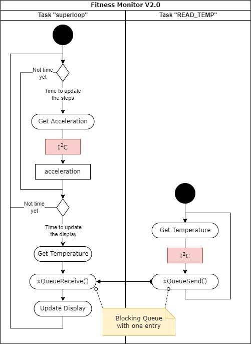

# ENCE464 - Fitness Monitor
**Group Number:** 12
**Group Members:** Alister Giles, Matt Walker, Andy Ming

## Table of Contents
- [Introduction](#introduction)
- [Analysis of Existing Architecture](#analysis-of-existing-architecture)
- [Summary of software design problem](#summary-of-software-design-problem)
- [Design of New Architecture (v2.0)](#design-of-new-architecture-v20)
- [Design of FreeRTOS tasking](#design-of-freertos-tasking)
- [I<sup>2</sup>C Implementation](#I<sup>2</sup>C Implementation)
- [Application of static and dynamic analysis](#application-of-static-and-dynamic-analysis)
- [Usefulness of documentation to future developers](#usefulness-of-documentation-to-future-developers)

## Introduction

This project is about the improvement of the current *Fitness Monitor V1.0*. The present documentation summarizes the findings and development of a imporved version *Fitness Monitor V2.0*. First a analysis of the software version 1.0 is done and key areas of improvements highlighted. After that the improved architecture of V2.0 is presented and detailed implementations of different components such as FreeRTOS or I<sup>2</sup>C are discussed. A short reflection on the involvement of static and dynamic analysis methods, a section on future improvements and a conclusion close the report.

## Analysis of Existing Architecture

Very layered architecture pattern. Not the best design for "Good" code, not the most maintainable (requires testing), it functions correctly but makes it difficult to extend the code if the scope changes.

Need to talk about maintainability and portability.
How to improve v1.0 - More abstraction, testing, consistent naming, encapsulation


The architecture of the Fitness Monitor v1.0 is clearly outlined in the provided diagram. The system is divided into several key modules, each responsible for a specific aspect of the overall functionality. The diagram uses a color-coded legend to differentiate between standard libraries, leaf modules or libraries, and components requiring further investigation. Key modules include `step_counter_main`, `display_manager`, `acc_manager`, `ADC_read`, `button_manager`, and several others that interact to form the system.

Each module's structure is depicted using class diagrams, showing the functions and attributes within each class. For example, the `step_counter_main` module includes functions like `initClock()`, `initDisplay()`, and `readCurrentTick()`, among others. This diagram provides a clear overview of how different components interact and the roles they play in the system.


The v1.0 dependencies depicted in the diagram illustrate how different modules interact with each other. The `step_counter_main` module serves as the central hub, interacting with nearly all other modules. For example, it communicates with the `display_manager` to update the display and with the `acc_manager` to process accelerometer data.

`display_manager` depends directly on the `OrbiOLEDInterface` for hardware-specific operations. `acc_manager` interacts directly with a circular buffer (`circBuf`) to manage accelerometer data and uses the `i2c_driver` for communication with the accelerometer chip. `ADC_read` interacts with `step_counter_main` to provide ADC data when required. `button_manager` and `switches` interact to manage user inputs, which are then relayed to the main module. This dependency structure shows a layered architecture where a single high-level module (`step_counter_main`) coordinates the actions of hardware-specific low level modules.


## Summary of software design problem
Specifies the v2.0 design (Superficially/Sufficiently/Comprehensively)


## Design of New Architecture (v2.0)

New code has mixture of multiple architecture types, overall architecture could be microkernel (we haven't really done this that well), with ports and adapters or pipes and filters with our extra abstraction layers.


### Design of FreeRTOS tasking
Describe and justify the task architecture.

<!-- ### Example Code Snippet
```c
// Example FreeRTOS task creation
xTaskCreate(TaskFunction, "TaskName", stackSize, NULL, priority, &taskHandle);

 -->

### I<sup>2</sup>C Implementation

The I<sup>2</sup>C bus is implemented through a hardware abstraction layer. There are two tasks using the bus to acquire data from the IMU and the temperature sensor. The following swimlane diagram shows that the two tasks "superloop" and "read_temp" are synchronized through a blocking queue with one entry and thus the I<sup>2</sup>C hardware is protected from double access. For the sake of simplicity only the functions concerning the I<sup>2</sup>C bus are shown.



This implementation is tested and doesn't lead to any issues in this implementation. However, it must be noted that this isn't a robust implementation, especially if the codebase is refactored and updated in the future. To better protect the hardware from simultaneous access, a mutex in the I<sup>2</sup>C module should be introduced.

## Application of static and dynamic analysis
Analyses aspects of the design to guide decisions (Poorly/Satisfactorily/Proficiently)


## Usefulness of documentation to future developers
Explains the existing design and how to modify it (Superficially/Sufficiently/Comprehensively)


## Conclusion
Summarize the key aspects of the new architecture and design improvements.

## References
- [Doxygen Documentation](https://www.doxygen.nl/)

## Appendices
Additional detailed information.
