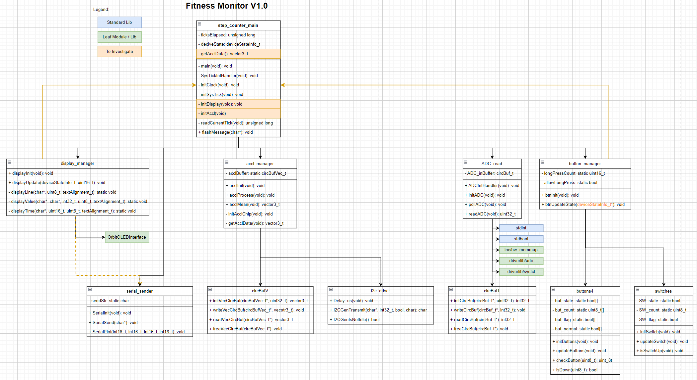

# Project Title
**Group Number:** 12
**Group Members:** Member 1, Member 2, Member 3

## Table of Contents
- [Introduction](#introduction)
- [Analysis of Existing Architecture](#analysis-of-existing-architecture)
- ...

## Introduction
Provide an overview of the project and the purpose of this documentation.

## Analysis of Existing Architecture
### Overview of v1.0 Architecture

The architecture of the Fitness Monitor v1.0 is clearly outlined in the provided diagram. The system is divided into several key modules, each responsible for a specific aspect of the overall functionality. The diagram uses a color-coded legend to differentiate between standard libraries, leaf modules or libraries, and components requiring further investigation. Key modules include step_counter_main, display_manager, acc_manager, ADC_read, button_manager, and several others that interact to form the system.

Each module's structure is depicted using class diagrams, showing the functions (methods) and attributes (fields) within each class. For example, the step_counter_main module includes functions like initClock(), initDisplay(), and readCurrentTick(), among others. This diagram provides a clear overview of how different components interact and the roles they play in the system.



### Execution Architecture
Describe how tasks or functions are executed in v1.0.

### Module Classification
Identify and describe the modules.

## Design of New Architecture (v2.0)
### Overview of v2.0 Architecture
Describe the new architecture.


### Task Architecture
Describe and justify the task architecture.

<!-- ### Example Code Snippet
```c
// Example FreeRTOS task creation
xTaskCreate(TaskFunction, "TaskName", stackSize, NULL, priority, &taskHandle);

 -->

## Conclusion
Summarize the key aspects of the new architecture and design improvements.

## References
- [Doxygen Documentation](https://www.doxygen.nl/)

## Appendices
Additional detailed information.
