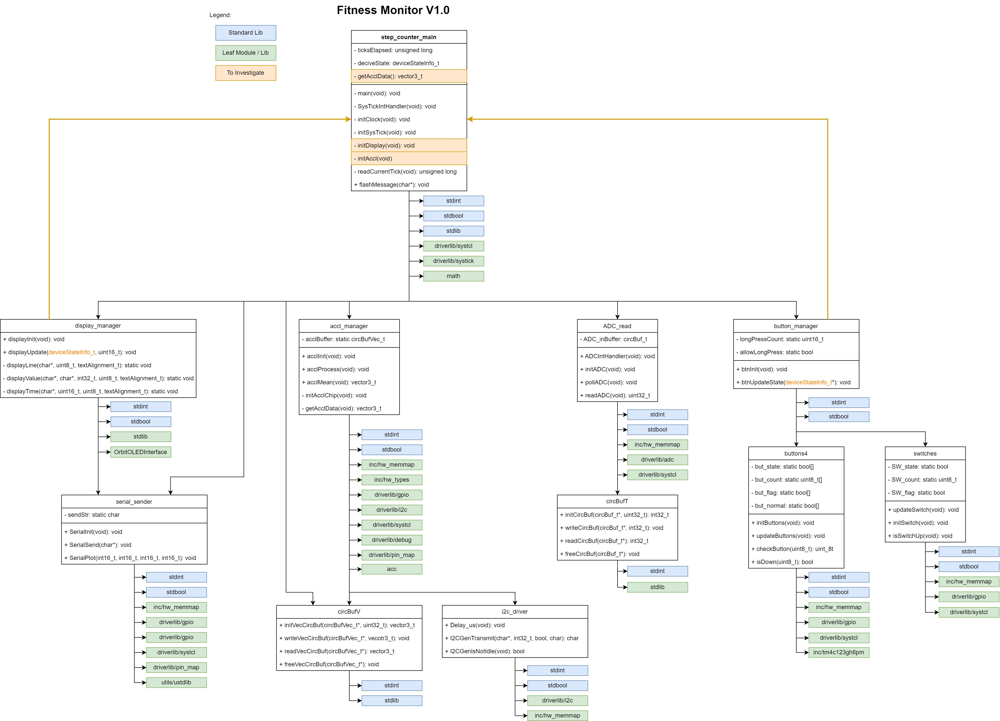
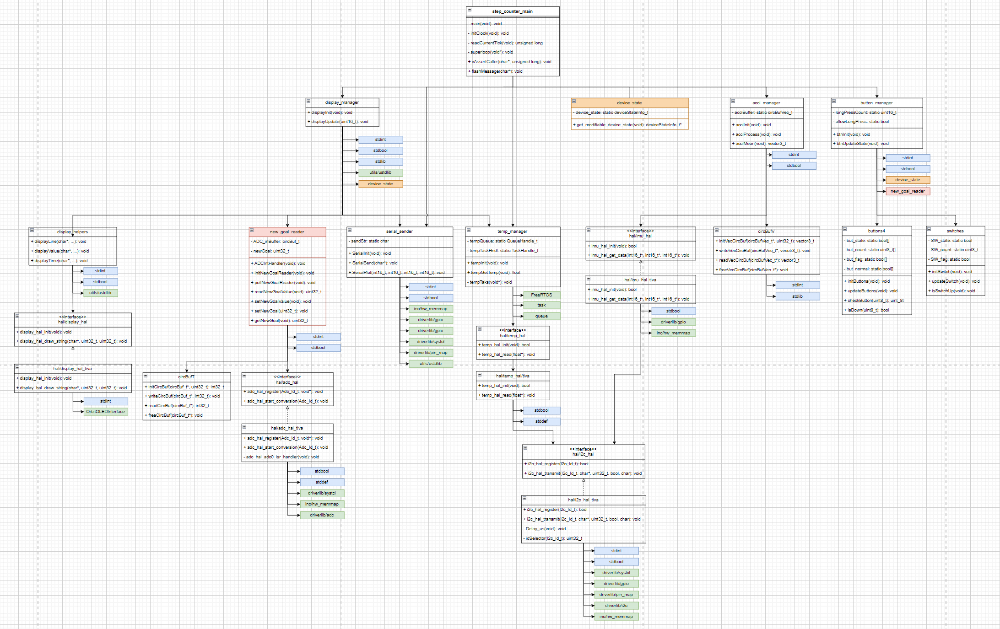

# Project Title
**Group Number:** 12
**Group Members:** Member 1, Member 2, Member 3

## Table of Contents
- [Introduction](#introduction)
- [Analysis of Existing Architecture](#analysis-of-existing-architecture)
- [Summary of software design problem](#summary-of-software-design-problem)
- [Design of New Architecture (v2.0)](#design-of-new-architecture-v20)
- [Design of FreeRTOS tasking](#design-of-freertos-tasking)
- [Application of static and dynamic analysis](#application-of-static-and-dynamic-analysis)
- [Usefulness of documentation to future developers](#usefulness-of-documentation-to-future-developers)

## Introduction
Provide an overview of the project and the purpose of this documentation.

## Analysis of Existing Architecture

The architecture of the Fitness Monitor v1.0 is clearly outlined in the provided diagram. The system is divided into several key modules, each responsible for a specific aspect of the overall functionality. The diagram uses a color-coded legend to differentiate between standard libraries, leaf modules or libraries, and components requiring further investigation. Key modules include step_counter_main, display_manager, acc_manager, ADC_read, button_manager, and several others that interact to form the system.

Each module's structure is depicted using class diagrams, showing the functions (methods) and attributes (fields) within each class. For example, the step_counter_main module includes functions like initClock(), initDisplay(), and readCurrentTick(), among others. This diagram provides a clear overview of how different components interact and the roles they play in the system.



The v1.0 dependencies depicted in the diagram illustrate how different modules interact with each other. The step_counter_main module serves as the central hub, interacting with nearly all other modules. For example, it communicates with the display_manager to update the display and with the acc_manager to process accelerometer data.

display_manager depends directly on the OrbiOLEDInterface for hardware-specific operations.
acc_manager interacts directly with a circular buffer (circBuf) to manage accelerometer data and uses the i2c_driver for communication with the accelerometer chip.
ADC_read interacts with step_counter_main to provide ADC data when required.
button_manager and switches interact to manage user inputs, which are then relayed to the main module.
This dependency structure shows a layered architecture where a single high-level module (step_counter_main) coordinates the actions of hardware-specific low level modules.


## Summary of software design problem
Specifies the v2.0 design (Superficially/Sufficiently/Comprehensively)


## Design of New Architecture (v2.0)
The new architecture takes a 




### Design of FreeRTOS tasking
Describe and justify the task architecture.

<!-- ### Example Code Snippet
```c
// Example FreeRTOS task creation
xTaskCreate(TaskFunction, "TaskName", stackSize, NULL, priority, &taskHandle);

 -->

## Application of static and dynamic analysis
Analyses aspects of the design to guide decisions (Poorly/Satisfactorily/Proficiently)


## Usefulness of documentation to future developers
Explains the existing design and how to modify it (Superficially/Sufficiently/Comprehensively)


## Conclusion
Summarize the key aspects of the new architecture and design improvements.

## References
- [Doxygen Documentation](https://www.doxygen.nl/)

## Appendices
Additional detailed information.
