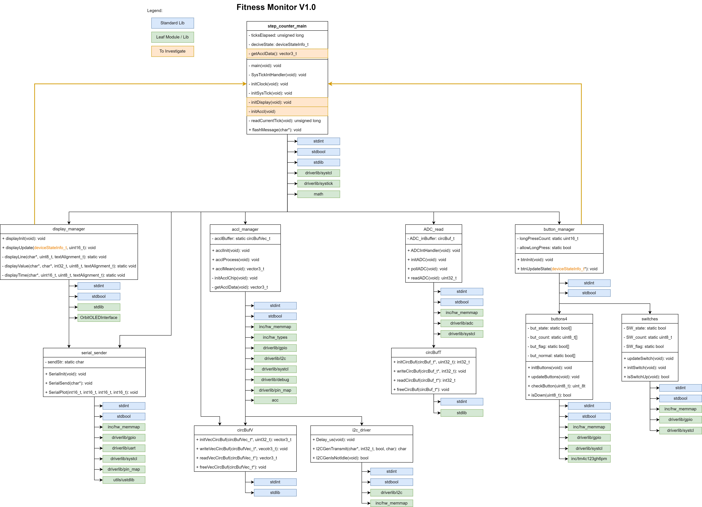

# ENCE464 - Fitness Monitor
**Group Number:** 12
**Group Members:** Alister Giles, Matt Walker, Andy Ming

## Table of Contents
- [Introduction](#introduction)
- [Analysis of Existing Architecture](#analysis-of-existing-architecture)
- [Design of New Architecture (v2.0)](#design-of-new-architecture-v20)
- [Design of FreeRTOS tasking](#design-of-freertos-tasking)
- [I<sup>2</sup>C Implementation](#I<sup>2</sup>C-Implementation)


## Introduction

The purpose of this project was to extend the functionality of an existing *Fitness Monitor V1.0* embedded software project. This project implements a simple step counter based on the provided specifications. This documentation summarises the findings and development of an extended version *Fitness Monitor V2.0* of the project. 
The software version 1.0 was analysed with key areas for improvements highlighted. The improved architecture of V2.0 is also presented and detailed implementations of key components are discussed. 

## Analysis of Existing Architecture

The architectural structure of Fitness Monitor v1.0 is a layered architecture where a single high-level module (`step_counter_main`) coordinates the actions of hardware-specific low level modules. The dependancies of the Fitness Monitor v1.0 are clearly outlined in the provided diagram. The system is divided into several key modules, each responsible for a specific aspect of the overall functionality. The diagram uses a color-coded legend to differentiate between standard libraries, leaf modules or libraries, and components requiring further investigation. Key modules include `step_counter_main`, `display_manager`, `acc_manager`, `ADC_read`, `button_manager`, and several others that interact to form the system.

Each module's structure is depicted using class diagrams, showing the functions and attributes within each class. For example, the `step_counter_main` module includes functions like `initClock()`, `initDisplay()`, and `readCurrentTick()`, etc. This diagram provides a clear overview of how different components interact and the roles they play in the system.



The `step_counter_main` module serves as the central hub, interacting with nearly all other modules. For example, it communicates with the `display_manager` to update the display and with the `acc_manager` to process accelerometer data.

`display_manager` depends directly on the `OrbitOLEDInterface` for hardware-specific operations. `acc_manager` interacts directly with a circular buffer (`circBuf`) to manage accelerometer data and uses the `i2c_driver` for communication with the accelerometer chip. `ADC_read` interacts with `step_counter_main` to provide ADC data when required. `button_manager` and `switches` interact to manage user inputs, which are then relayed to the main module. 

### Initial Issues

Fitness monitor v1.0 met the previous desired specifications, however with the intentions of extending the functionality several issues needed to be addressed. The main issues have to do with code maintainability and portability.

In order to improve the code maintainability the circular dependency from the two modules `display_manager` and `button_manager` back to the main module `step_count_main` through the type definition `deviceStateInfo_t` needed to be addressed. This circular dependancy prevents interchangeability and reuse of these modules, and means that in order to improve code changes need to be made in multiple locations.

Another critical flaw is the direct interaction of most modules with hardware-specific libraries, this reduces the system's portability to other platforms. For example, the `acc_manager` and `ADC_read` modules directly interface with the accelerometer and ADC hardware, respectively, without any abstraction layer. This design choice tightly couples the software with the specific hardware. The absence of a hardware abstraction layer (HAL) means that any attempt to migrate the system to a new hardware platform would require extensive rework. This design also complicates testing since hardware-specific dependencies cannot be easily mocked or simulated.

Another maintainability issue is that the core logic of the application is concentrated within a single loop in the step_counter_main module. This design obscures the overall structure and flow of the application, making it difficult to understand and extend. The absence of any testing framework further exacerbates this issue, as it becomes challenging to verify the correctness of individual modules or identify potential breakages during refactoring. 

### Summary of next steps

To address the *Fitness Monitor V1.0* issues, several changes will be made to the code including:
- Refactoring key sections of the codebase to incorporate SOLID principles. Mainly to better encapsulate data, particularly the deviceStateInfo_t, to improve modularity and reduce tight coupling between components.
- Hardware interactions should be abstracted through the implementation of hardware interfaces, enhancing portability and simplifying potential future hardware migrations.
- Implementing an RTOS (Real-Time Operating System) to distribute tasks more effectively, improve code organization, maintainability, and scalability.
- The Unit test framework (Unity) will be used for both maintaining/refactoring code, verifying correctness, and when using test driven design (TDD).
- Implement extended functionality.


## Fitness Monitor V2.0 Specification

The Fitness Monitor v2.0 is designed with an intuitive and responsive user interface that interacts seamlessly with the user via buttons and a scroll wheel. The scroll wheel input is controlled by the potentiometer on the Orbit board, providing an analogue signal on pin AIN0. There are three main screens available:

- Screen #1 (Fitness Monitor Main Screen) displays the current version of the fitness monitor, the number of steps counted since the last reset or power cycle (initialized to zero), the elapsed time from when the first step is detected (also initialized to zero), and the current temperature in degrees Celsius.
- Screen #2 (Set Goal Screen) allows users to adjust a new prospective step goal using the scroll wheel while displaying the current step goal.
- Screen #3 (Distance and Speed Screen) shows the distance traveled based on the number of steps, the elapsed time since the first step was detected, the average speed, and whether the user has been walking or running (running is defined as an average speed of 10 km/h or more).

Upon startup, the OLED board defaults to Screen #1, with all values initialized to zero except for the step goal, which is set at 1,000 steps. Pressing the RESET button on the TIVA board restarts the program and returns all stored step, distance, and goal values to their defaults.

The RIGHT button on the Orbit board cycles through the screens in a forward direction: from Screen #1 to Screen #2, then to Screen #3, and wraps around back to Screen #1. The LEFT button cycles through the screens in the opposite direction: from Screen #1 to Screen #3, then to Screen #2, and back to Screen #1. The UP button on the TIVA board toggles the units displayed by the fitness monitor. For steps, it toggles between the raw number of steps and the percentage of the step goal achieved. For distance, it toggles between kilometers and miles, with all units clearly displayed on the OLED.

In Screen #2, briefly pressing the DOWN button sets the new step goal displayed. When not on Screen #2, a long press on the DOWN button resets the number of steps and the distance traveled to zero. The user interface provides feedback to differentiate between long and short presses on the DOWN button. The goal value can be adjusted in increments of 100 steps by rotating the potentiometer on the Orbit board, with clockwise rotation increasing and anti-clockwise rotation decreasing the displayed value. This new value is only set as the goal when the DOWN button is briefly pressed.

The fitness monitor also features a test mode activated by setting SW1 to the UP position. In test mode, each press of the UP button increments the step count by 100 and the distance by 0.09 km, while the DOWN button decrements the step count by 500 and the distance by 0.45 km. Other functionalities of the UP and DOWN buttons, such as toggling units and setting goals, are disabled in test mode, but the LEFT and RIGHT buttons function normally. Setting SW1 back to the DOWN position restores normal functionality.

Extended features from Fitness Monitor v1.0 include the display of ambient temperature in degrees Celsius on Screen #1. On Screen #3, the device identifies whether the user has been walking or running based on their average speed, displaying "Running!" for speeds of 10 km/h or more, and "Walking." for slower speeds. If no steps are detected for more than 60 seconds, a prompt flashes on the screen, encouraging the user to move. If no steps have been detected since startup, the message "Get Moving!" appears, while "Keep Moving!" is shown if the user has been stationary after previously taking steps.

## Design of New Architecture (v2.0)

In order to address the next steps required to make *Fitness Monitor V2.0* work the overall architecture needed to be changed. Using FreeRTOS tasks essentially creates a microkernel structure, the internal architecture of each task was changes to ports and adapters to incorporate the HAL's (and improve portability). The overall structure can be seen in the diagram below.


This change in architecture has improved the overall maintainability of the code by decreasing coupling, removing circular dependancies, and increasing abstraction. 


### Implementation of Testing

Testing was incorporated into the design of *Fitness Monitor V2.0* both to protect the code when refactoring and when using TDD to program new functionality.
Test cases were written for existing files top-level modules such as `accl_manager`, `display_manager` and `ADC_read`, as well as lower level modules such as 
`circBuf`.
Test files for new modules such as the hardware abstraction modules were implemented _before_ the modules themselves. Applying proper TDD principles and developing a range of test cases _first_ allowed for early bug detection and maintainability.


### Design of FreeRTOS tasking

In the *Fitness Monitor V2.0* architecture, FreeRTOS is employed to manage the scheduling and execution of tasks in a more organized and responsive manner. The key tasks implemented under this design include the superloop task, prompt-to-move task, and read temperature task. Each task is designed with specific responsibilities and priority levels to ensure efficient operation of the fitness monitor. 

#### Superloop Task

The superloop task contains calls to all original V1.0 program functionality. It is responsible for managing core functionalities such as polling inputs, processing accelerometer data, updating the display, and sending data over serial communication (when enabled). It operates continuously in a loop, checking for time intervals to execute its various subtasks. 
- Polling Inputs: The superloop periodically polls buttons and the potentiometer to capture user interactions. The timing for these polls is managed by checking against a system tick counter (`currentTick`), ensuring that inputs are processed at regular intervals defined by `RATE_IO_HZ`.
- Accelerometer Processing: The task also handles the accelerometer data processing. It calculates the magnitude of the accelerometer vector and determines if a step has been detected. This processing is critical for the step counting functionality of the fitness monitor. The task also monitors whether the user has reached their goal, triggering a flash message if the goal is achieved.
- Display Update: Another critical function of the superloop is updating the display at regular intervals, ensuring that the information presented to the user (e.g., steps taken, elapsed time) is current. The display update is handled in a manner that integrates seamlessly with the device's state, including handling flash messages when necessary.
- Serial Communication: If serial plotting is enabled, the superloop also handles the sending of data via USB at specified intervals. This functionality is critical for logging and external monitoring of the device's operation.

#### Prompt-to-Move Task
The prompt-to-move task is a periodic task triggered by a hardware timer interrupt. This task serves as a reminder to the user to stay active by prompting them to move after a set period of inactivity - _this period can be set in `prompt_to_move.c`_.
The timer is initialized to generate interrupts at a specified interval, configured via the `timer_hal_init` function. Upon each interrupt, the corresponding interrupt service routine (ISR) clears the interrupt and notifies the prompt-to-move task. 
Once notified, the task executes the `act_on_prompt_to_move` function, which could involve displaying a message on the screen or triggering an alert to prompt the user to get moving.

#### Read-Temperature Task
The read temperature task is responsible for periodically reading the device's temperature sensor and storing the results for use by other system components, such as the display manager.
This task uses a FreeRTOS queue to store the most recent temperature reading. The temperature is read via the temp_hal_read function and then sent to the queue (more depth in section: I<sup>2</sup>C Implementation). Other tasks, such as those responsible for updating the display, can retrieve the temperature data from this queue when needed.
The task runs continuously in a loop, periodically reading the temperature sensor and updating the queue. It is designed with a relatively high priority to ensure that the temperature readings are kept current, which is especially important for applications where temperature monitoring is critical.


### I<sup>2</sup>C Implementation

The I<sup>2</sup>C bus is implemented through a hardware abstraction layer. There are two tasks using the bus to acquire data from the IMU and the temperature sensor. The following swimlane diagram shows that the two tasks "superloop" and "read_temp" are synchronized through a blocking queue with one entry and thus the I<sup>2</sup>C hardware is protected from double access. For the sake of simplicity only the functions concerning the I<sup>2</sup>C bus are shown.


This implementation is tested and doesn't lead to any issues in this implementation. However, it must be noted that this isn't a robust implementation, especially if the codebase is refactored and updated in the future. To better protect the hardware from simultaneous access, a mutex in the I<sup>2</sup>C module should be introduced.

### Display Implementation

The design of the display modules follows a modular architecture where each module is responsible for a specific set of tasks. The primary modules involved are:

- `display_manager.c`: Handles the overall display update logic based on the device's state.
- `display_hal.c`: Provides hardware abstraction for display operations, allowing the display manager to work with different hardware without modification.
- `display_helpers.c`: Contains utility functions for rendering text and values on the display, supporting different alignment options and formatting.

The display manager file handles the most basic commands to the display, initialize and update.
The `displayInit` function initializes the display subsystem by calling the hardware abstraction layer's initialization function `display_hal_init`.
The `displayUpdate` is called periodically to update the screen based on the current state of the device.

These functions call the `display_helpers` functions `displayLine`, `displayValue`, and `displayTime`. These are general purpose functions that 'draw' onto the screen. 
These general purpose functions call the hardware abstraction layer `display_hal` functions. The purpoe of this file is to allow the software to be modified minimally in order to change hardware. The functions within this module 

The system is designed with a clear separation of concerns. Each module is responsible for a specific aspect of the display management process, which makes the system easier to maintain, extend, and test. For example, the HAL layer can be modified to support a different display type without changing the higher-level display logic.

Here is an excerpt from the hal file showing how the program could be modified for alternative hardware (for future developers):
```c
// Example HAL Layer Function
void display_hal_init(void) {
    switch (CURRENT_BOARD) {
        case TIVA_BOARD:
            OLEDInitialise();
            break;
        case ALTERNATIVE_HARDWARE:
            break;
        default:
            break;
    }
}
```