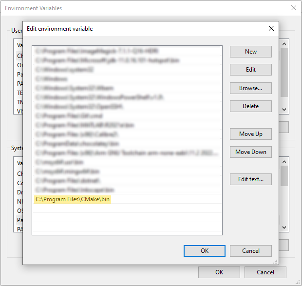

[[_TOC_]]

# Visual Studio Code

Visit https://code.visualstudio.com/download to download latest version.

On Windows you may be able to use `winget` to update or install VS Code:

```
winget install --id Microsoft.VisualStudioCode
```

On macOS or Linux, you could install VS Code via your package manager, but it is
probably better to use one of the download methods listed at
https://code.visualstudio.com/download to get the most up-to-date version.

# Windows

## Build system

Install [CMake](https://cmake.org/download/). Make sure
`C:\Program Files\CMake\bin` is added to the `PATH` environment variable
(see below, the installer may do this automatically).

CMake can also be installed via winget:

```
winget install -e --id Kitware.CMake
```

To add variables to `PATH`, search for **Edit the system environment variables**
in the Start Menu, then open **Environment variables...** from the settings
window, then double-click on the `Path` variable in either the user or system
variables boxes. Then click **New** to add each path.



## In-circuit debugger driver

You will need to download the [Stellaris ICDI Drivers](https://www.ti.com/tool/STELLARIS_ICDI_DRIVERS).
Follow the instructions in the installation guide in the link. Note that if you
have installed Code Composer Studio (e.g. for ENCE361), then the drivers will
already be installed.

## Embedded and host toolchains

For the toolchain (compiler, OpenOCD), there are two options:

### Option 1: Copy toolchain from lab PCs

Using a flash drive or similar, copy the entire `C:\ence464` directory from the
lab PCs to the same location on your machine.

Add the following directories to `PATH`:

* `C:\ence464\msys64\mingw64\bin`
* `C:\ence464\msys64\usr\bin`

This is the same setup as the Windows machines in the ESL. It also includes the
necessary host programs for building host tests.

### Option 2: Install toolchain yourself

This option may be faster than transferring the toolchain directory via USB
drive if you have a fast internet connection.

Install [MSYS2](https://www.msys2.org/) to `C:\msys64`. Then open the 'MSYS2
MSYS' console from the Start Menu and run the following command in the terminal:

```
pacman -S \
   make \
   mingw-w64-x86_64-arm-none-eabi-toolchain \
   mingw-w64-x86_64-gcc \
   mingw-w64-x86_64-gdb-multiarch \
   mingw-w64-x86_64-openocd \
   mingw-w64-x86_64-ruby
```

Add the following folders to `PATH`:

* `C:\msys64\mingw64\bin`
* `C:\msys64\usr\bin`

### Checking everything works

Open a new command prompt window (`Windows+R`, type `cmd` and press `Enter`) and
run:

```
where.exe arm-none-eabi-gcc gcc gdb-multiarch make openocd ruby
```

If everything was set-up properly, the paths to each of the commands will be
listed without any error messages.

**Important:**: if you already had VS Code open during installation, you must
close and re-open the app so that it detects the new `PATH` environment
variable. (The same applies for any shells/command prompts you have opened.)

# MacOS

Use [Homebrew](https://brew.sh/) to install CMake, OpenOCD, and the embedded
toolchain:

```
brew install cmake llvm openocd ruby
brew install --cask gcc-arm-embedded
```

If the second command doesn't work, you may have an older version of Homebrew -
run `brew cast install gcc-arm-embedded` instead.

If you already have Xcode installed, you can leave `llvm` out of the above
command.

# Linux

For Debian-based systems such as Ubuntu:

```
sudo apt-get update
sudo apt-get install \
   build-essential \
   cmake \
   gcc-arm-none-eabi \
   gdb-multiarch \
   libnewlib-arm-none-eabi \
   openocd \
   ruby
```

Other Linux distributions with different package managers will have
similarly-named packages.
