# Visual Studio Code instructions

[[_TOC_]]

Before configuring VS Code for the first time, ensure that any `target/build` or
`tests/build` directories are deleted.

There are a few different ways to open VS Code in the top-level directory of
this repository:

* Inside VS Code, open 'File' -> 'Open folder...'
* In a terminal, run:

  ```
  code <path to this directory>
  ```

  E.g. `code .` if you have this directory open in a terminal.
* From the file explorer, right-click on the repository directory and select
  **Open with Code**. (This option may only be available on Windows.)

  

On opening VS Code, you should be prompted to install recommended extensions -
accept this prompt. If you don't see a prompt press `Ctrl+Shift+P` and type
`Extensions: Show Recommended Extensions` and press `Enter`.

## 💡 VS Code tips

* **File search**: Press `Ctrl+P` to search for and open any file in the
  workspace. The search is *fuzzy*, meaning you can just type part of the
  filename to search for it.
* **Command Palette**: `Ctrl+Shift+P` opens the command palette, which allows
  you to run commands or configure settings without leaving the keyboard.
* **File explorer**: `Ctrl+Shift+E` opens the file explorer sidebar, which shows
  a collapsible tree view of all the files in the workspace.
* **Terminal**: ``Ctrl+Shift+` `` (backtick, below the `~` key) opens a new
  terminal. You can change the terminal type (command prompt, Git Bash, etc.) by
  clicking on the dropdown box by the `+` symbol in the top-right corner of the
  terminal panel. ``Ctrl+` `` opens the current terminal.
* **Jump to symbol**: Press `Ctrl+Shift+O` to search for and jump to a global
  symbol (function, struct definition, global variable declaration etc.) in the
  current file. Press `Ctrl+T` to search for symbols in the entire workspace.
  You can also hold `Ctrl` and click on a symbol to jump to its definition.
* **Go back/forward**: Press `Alt+Left` to jump back to the previous location in
  the editor. Press `Alt+Right` to go forward again.
* **Search in file**: Press `Ctrl+F` to search in the current file.
* **Search in entire workspace**: Press `Ctrl+Shift+F` to search all files in
  the workspace.

Most tasks in this guide can be accomplished through either the GUI or the
command palette. Once you get the hang of using it, it is often much more
efficient to use the command palette.

See the
[official VS Code documentation](https://code.visualstudio.com/docs/getstarted/tips-and-tricks)
for more tips.

## ⚙️ Configure CMake

1. Open `target/CMakeLists.txt` in the editor window. VS Code's file search
   feature is helpful here: you can just press `Ctrl+P` and type
   `target cmakelists` and press `Enter` to open the file:

   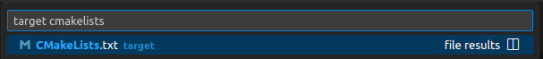

2. Open the **CMake** extension from the sidebar.

   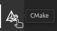

3. Make sure that `TM4C123` is listed under
   the **Configure** section. If not, click the pencil icon next to the first
   item and select the `TM4C123` build kit. (Alternatively, run **CMake: Select
   a Kit** from the command palette by pressing `Ctrl+Shift+P`.)

   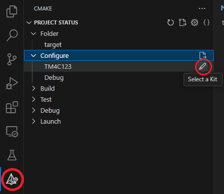

   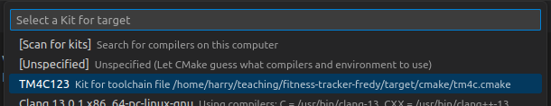

3. Click the **Configure** icon next to the **Configure** menu button, or run
   the **CMake: Configure** command via the command palette (`Ctrl+Shift+P`).

   

   This can take around 30 seconds on the ESL lab machines. When configuration
   is finished, you will see the message:

   ```
   [cmake] -- Configuring done
   [cmake] -- Generating done
   [cmake] -- Build files have been written to: <path-to-repository>/target/build
   ```

   Printed in the **Output** panel at the bottom of the window. A directory
   named `build` will be created in the `target` directory.

**Note**: you only have to run the configure commands once. Subsequent builds
can be triggered just via the build commands (see below). You should only have
to re-configure if you delete the `build` directory.

## 🔧 🚀 Build and upload a demo program

To start off, build the demo `blinky` program, which just flashes the LED on the
LaunchPad using FreeRTOS. The code for this demo is located in
`target/demos/blink/blinky.c`.

1. **Set the build target**: From the CMake sidebar, click the pencil icon next
   to the first item under the **Build** menu and choose the `blinky` build
   target. Alternatively, run **CMake: Set build target** via the command
   palette (`Ctrl+Shift+P`).

   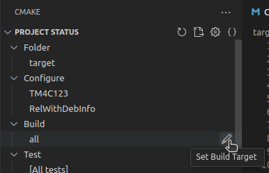

2. **Build the program**: Press `F7` or click the **Build** button in the bottom
   toolbar.

   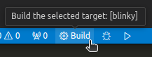

   Wait for the build to finish. If everything was successful, you should see
   the message

   ```
   [build] Build finished with exit code 0
   ```

   Printed in the **Output** panel.

3. To upload the built program to your device, first connect the device to your
   machine using a Micro USB cable. Under the **Project Outline** section of the
   CMake sidebar, you will find a list of build targets. Expand the
   `FitnessTracker > demos > blinky` option and click on the build icon next to
   the `program-blinky` option to upload the program to the device.

   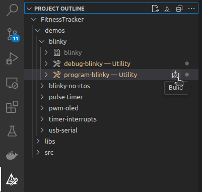

   (Alternatively, you can press `Shift+F7` to get a list of all targets, and
   select the `program-blinky` option.)

   If everything goes well, you should see the red LED on the LaunchPad flashing
   rapidly.

## 🐞 Debugging on target

From the CMake sidebar, click the pencil icon next to the first item listed
under the **Debug** menu and change the debug target to `blinky`. Alternatively,
open the command palette (`Ctrl+Shift+P`) and run the **CMake: Set Debug
Target**.

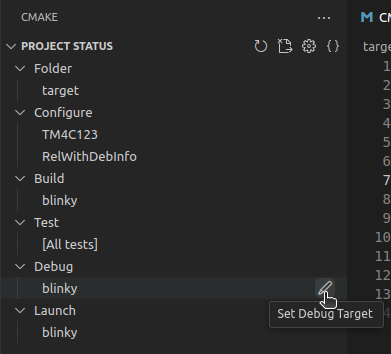

Open the **Run and Debug** sidebar (`Ctrl+Shift+D`), select `Debug-target` from
the drop-down menu next to the green play button and press the play button. This
will  to upload the `blinky` program to the device and attach the debugger to it.
Alternatively, pressing `F5` will do the same thing, provided  `Debug-target` is
selected.

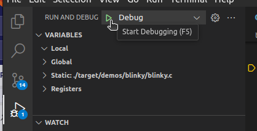

A breakpoint will be automatically placed at `main`, so the program will break
here once the debugger has started.

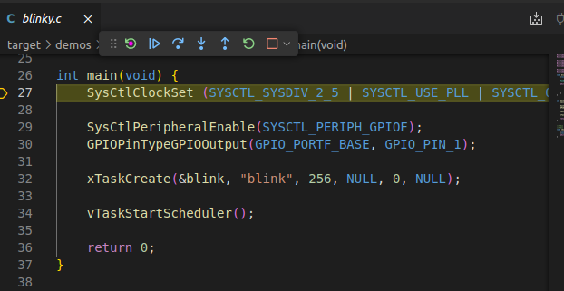

Breakpoints can be toggled by clicking to the left of the line number. A
breakpoint is set at a specific line if there is a small red circle next to its
number.

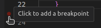

You can step through the program using the buttons on the debug control toolbar:

* 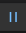 **Pause** (`F6`) to pause the program.
* 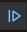 **Continue** (`F5`) to run the
  program until the next breakpoint.
* 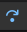 **Step Over** (`F10`) to run the
  next line of code within the same function.
* 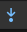 **Step Into** (`F11`) to run the
  next line of code, entering any functions that are called.
* 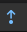 **Step Out** (`Shift+F11`) to run
  the current function until it returns to the calling scope.
* 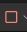 **Stop** (`Shift+F5`) to stop the debugger.

See the official [VS Code documentation](https://code.visualstudio.com/docs/editor/debugging)
for more info on using the debugger.

## 🔧 🚀 Building and uploading other programs

Follow the above instructions for building, programming, and debugging to run
other demo programs or the main project code, which is located under the
`target/src` directory.

For example, to build the main fitness tracker program, set the build target to
`fitness-tracker`. To upload the main fitness tracker program, select the
`program` target from the `FitnessTracker > src` menu in the **CMake** sidebar.

## 🧪 Building and running tests

Since the unit tests will be run on the host (development) machine rather than
the microcontroller and thus require a different compiler toolchain, CMake
requires that we use a separate `build` directory.

To configure tests, open `tests/CMakeLists.txt` in the editor. From the command
palette (`Ctrl+Shift+P`), run the **CMake: Select a Kit** command and select a
native build kit for your machine:

* On Windows (including the lab machines), this will be `GCC` for
  `x86_64-w64-mingw`. (You can also use the Microsoft `Visual Studio` compiler
  if you have this installed.)
* On Linux, this will be `GCC` for `x86_64-linux-gnu`.
* On macOS, this will be `Clang` for `x86_64-apple-darwin` or
  `aarch64/arm64-apple-darwin` depending on whether you have an Intel- or
  ARM-based Mac.

If you can't find the `GCC` kit, try running the **CMake: Scan for Kits**
command from the command palette (`Ctrl+Shift+P`).

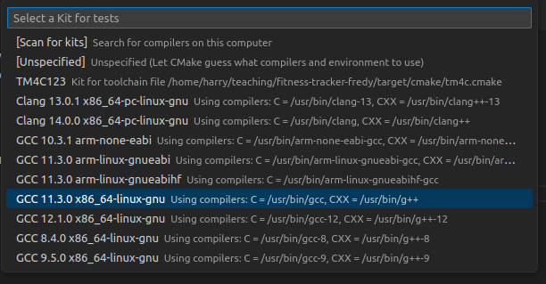

Then run the **CMake: Configure** command from the command palette
(`Ctrl+Shift+P`) to configure the project. As with the microcontroller build
setup, this will create a `build` directory under the `tests` directory. You
only have to run this step once unless you delete the `build` directory.

To run the tests, run **CMake: Refresh Tests** via the command palette
(`Ctrl+Shift+P`), then open the test explorer from the sidebar on the left (the
flask icon). Press the play button next to the `tests` line to build run all
tests, or run a specific test by clicking the play button next to its name.

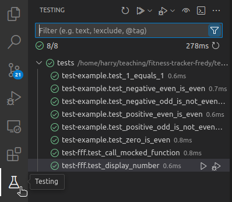

You can also filter specific tests by typing part of the name in the search bar;
for example, to only run tests from `test-fff` in the below screenshot, type
`test-fff.` into the search bar and then click the play button next to the
`tests` line.

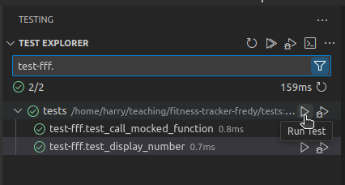

Passing tests will have a green checkmark next to them. Failing tests will have
a red cross and the reason for failure will be printed in the **Output** panel.
For example, change the `test_1_equals_1` function in `tests/test-example.c` to:

```c
void test_1_equals_1(void)
{
    TEST_ASSERT_EQUAL(1, 2);
}
```

Re-run the test. The test will fail, showing a red cross next to the test name.

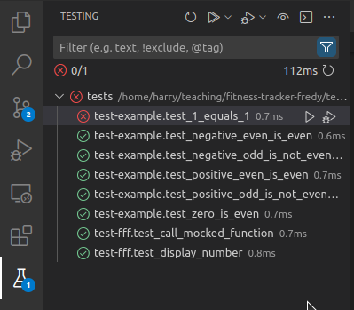

And the following will be printed in the output:

```
...
[ctest] 1/1 Test #1: test-example.test_1_equals_1 .....***Failed    0.00 sec
[ctest] test-example.c:15:test_1_equals_1:FAIL: Expected 1 Was 2
[ctest]
[ctest] -----------------------
[ctest] 1 Tests 1 Failures 0 Ignored
[ctest] FAIL
...
```

## 🐞 Debugging tests
You can attach a debugger to the tests by following the same process as 
[Debugging on target](#-debugging-on-target) with these exceptions:
* In the **CMake** sidebar, set the **Folder** field to `tests`.
* In the **Run and Debug** sidebar, select `Debug-tests`.
* You will need to manually add a breakpoint in the tests you want to debug,
since it doesn't automatically stop at `main()` like the target debugger.
